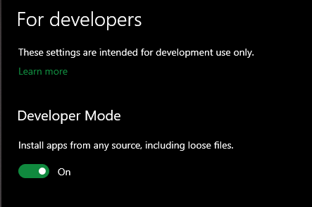
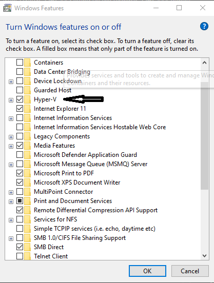

# Terminal-from-scratch

When crash your computer windows or Linux have to have remembered all the stuff installed before to set them again once recover your OS.

This Blog has the purpose to encapsulate all the steps to set again all stuff minimum necessary to start to code again.


---

## Setting up the terminal

### Installing WSL (only apply for Windows)

In windows you have to set WSL first to use Linux and this is the way.

- [How install wsl in windows](https://docs.microsoft.com/en-us/windows/wsl/install-win10)

First in the settings in windows the developer mode has to on.



Once the developers mode has been actived, the next step is active Hyper-v and Windows Subsystem for linux, for this step just type key Windows and type: **turn windows features on or off**




Step 1 - Open power shell as administrative and type next to enable the Windows Subsystem for Linux

```
dism.exe /online /enable-feature /featurename:Microsoft-Windows-Subsystem-Linux /all /norestart
```

Step 2 - Update to WSL 2

Requirements

- For x64 systems: Version 1903 or higher, with Build 18362 or higher.
- For ARM64 systems: Version 2004 or higher, with Build 19041 or higher.
- Builds lower than 18362 do not support WSL 2. Use the Windows Update Assistant to update your version of Windows.

To check your version and build number, select Windows logo key + R, type winver, select OK. (Or enter the ver command in Windows Command Prompt). [Update to the latest Windows version](ms-settings:windowsupdate) in the Settings menu.

Step 3 - Enable Virtual Machine feature

```
dism.exe /online /enable-feature /featurename:VirtualMachinePlatform /all /norestart
```
Step 4 - Download the Linux kernel update package

Download the [WSL2 Linux kernel update package for x64 machines](https://wslstorestorage.blob.core.windows.net/wslblob/wsl_update_x64.msi)

Step 5 - Set WSL 2 as your default version

Open PowerShell and run this command to set WSL 2 as the default version when installing a new Linux distribution:

```
wsl --set-default-version 2
```

Step 6 - Install your Linux distribution of choice

Open the [Microsoft Store](https://aka.ms/wslstore) and select your favorite Linux distribution.


After all the steps, open ubuntu in your system and leave to end the installation

---

### Installing OH-MY-ZSH


Step 1- Installing ZSH and git-core

open the terminal and type next:

```
sudo apt-get install zsh
sudo apt-get install git-core
```

Step 2 - Download ZSH and execute

```
wget https://github.com/robbyrussell/oh-my-zsh/raw/master/tools/install.sh -O - | zsh
```

Step 3 - Change from sheel to ZSH

```
chsh -s `which zsh`
```

Step 4 - Restart your system

---


### Installing Git

Step 1 - Open the terminal and type 

```
sudo apt install git-all
```

Step 2 - you can check the git version with

```
git --version
```

Step 3 - Connect git with github

Configure your e-mail in git (the same as your github account)

```
git config --global user.email cargdev@example.com
```

Generate the SSH key

```
ssh-keygen -t rsa -b 4096 -C "cargdev@example.com"
```

Check the key in with the terminal

```
eval $(ssh-agent)
```

Add the key to Windows

```
ssh-add ~/.ssh/id_rsa
```

Copy your public key to github locate in --> ~/.ssh/id_rsa.pub
In github go to Account/setting/SSH and GPG keys and add New SSH Key and Add it


---


### Installing Nodejs and NPM


Step 1 - Update the system using apt package manager index by running the following command.

```
sudo apt update
```

Step 2 - Install Node.js global repository by typing

```
sudo apt install node
```

Step 3 - Confirm the installation of Node.js by typing

```
node --version
```

Step 4 - Install npm by running following command

```
sudo apt install npm
```

Step 5 - Confirm the installation of npm by typing

```
npm --version
```

---

### Installing VS Code

Step 1 - Install wget if not present.

```
sudo apt update
sudo apt -y install wget
```

Step 2 - Add Visual Studio Code repository and key

```
sudo apt update
sudo apt install apt-transport-https
curl https://packages.microsoft.com/keys/microsoft.asc | gpg --dearmor > microsoft.gpg
sudo install -o root -g root -m 644 microsoft.gpg /etc/apt/trusted.gpg.d/
```

Step 3 - Add APT repository to the system

```
sudo sh -c 'echo "deb [arch=amd64] https://packages.microsoft.com/repos/vscode stable main" > /etc/apt/sources.list.d/vscode.list'
```
Step 4 - Visual Studio Code on

```
sudo apt update
sudo apt install code
```

To launch the text editor type next in the terminal

```
code
```

---

### Installing NVIM

Step 1 - Install [Neovim PPA](https://launchpad.net/~neovim-ppa/+archive/ubuntu/unstable)

```
sudo add-apt-repository ppa:neovim-ppa/unstable
```

then update the packages

```
sudo apt-get update
sudo apt-get install neovim
```

Step 2 - Check the installation

```
nvim
```

Step 3 - Install the copy clipboard due to NVim can copy to your system

```
sudo apt install xclip
sudo apt install xsel
```

Step 4 - Install [Python interface](https://github.com/neovim/python-client), this because some plugins in NVim use python to work

```
sudo apt install python3-pip
```

Then install the NVim interface

```
python3 -m pip install neovim
```

Step 5 - Upgrade python interface

```
python3 -m pip install --upgrade neovim
```

Step 6 - Install ruby, due to some interfaces from Python use [Ruby](https://rubygems.org/gems/neovim/)

```
sudo apt install ruby
sudo apt install ruby-dev
```

Install Ruby interface

```
sudo gem install neovim
```

Step 7 - Checl the nvim dependencies

```
nvim +checkhealth
```


Step 8 - Install the plug installator, in this case is vim-plug

In the terminal type the text below
```
sh -c 'curl -fLo "${XDG_DATA_HOME:-$HOME/.local/share}"/nvim/site/autoload/plug.vim --create-dirs \
       https://raw.githubusercontent.com/junegunn/vim-plug/master/plug.vim'
```
A minimalist Vim plugin manager.


To check how use vim please go to [how use vim](http://vimsheet.com/)

To install the vim configuration I use check my [VIM Repository](https://github.com/CarGDev/Vim-configuration)

---

## Installing autosuggestions and syntax-highlighting for ZSH


### zsh-autosuggestions


Requirements: Zsh v4.3.11 or later

<a href="https://asciinema.org/a/37390" target="_blank"></a>


Step 1 - Clone this repository into `$ZSH_CUSTOM/plugins` (by default `~/.oh-my-zsh/custom/plugins`)

```sh
    git clone https://github.com/zsh-users/zsh-autosuggestions ${ZSH_CUSTOM:-~/.oh-my-zsh/custom}/plugins/zsh-autosuggestions
```

Step 2 - Add the plugin to the list of plugins for Oh My Zsh to load (inside `~/.zshrc`):

```sh
    plugins=(zsh-autosuggestions)
```

Step 3 - Start a new terminal session.


## zsh-syntax-highlighting

Step 1 - Clone this repository in oh-my-zsh's plugins directory:

```zsh
    git clone https://github.com/zsh-users/zsh-syntax-highlighting.git ${ZSH_CUSTOM:-~/.oh-my-zsh/custom}/plugins/zsh-syntax-highlighting
```

Step 2 - Activate the plugin in `~/.zshrc`:

```zsh
    plugins=( [plugins...] zsh-syntax-highlighting)
```

Step 3 - Restart zsh (such as by opening a new instance of your terminal emulator).


---

## Installing Powerlevel 10k for ZSH

Step 1 - Install the theme typing next

```zsh
git clone --depth=1 https://github.com/romkatv/powerlevel10k.git ${ZSH_CUSTOM:-$HOME/.oh-my-zsh/custom}/themes/powerlevel10k
```

Step 2 - Set ZSH_THEME="powerlevel10k/powerlevel10k" in ~/.zshrc.

Step 3 -  Restart zsh (such as by opening a new instance of your terminal emulator).

Note: to use all the icons in this theme is recommended use [Meslo Nerd Font](https://github.com/romkatv/powerlevel10k/blob/master/font.md)

Manual font installation
Download these four ttf files:

- [MesloLGS NF Regular.ttf](https://github.com/romkatv/powerlevel10k-media/raw/master/MesloLGS%20NF%20Regular.ttf)
- [MesloLGS NF Bold.ttf](https://github.com/romkatv/powerlevel10k-media/raw/master/MesloLGS%20NF%20Bold.ttf)
- [MesloLGS NF Italic.ttf](https://github.com/romkatv/powerlevel10k-media/raw/master/MesloLGS%20NF%20Italic.ttf)
- [MesloLGS NF Bold Italic.ttf](https://github.com/romkatv/powerlevel10k-media/raw/master/MesloLGS%20NF%20Bold%20Italic.ttf)

